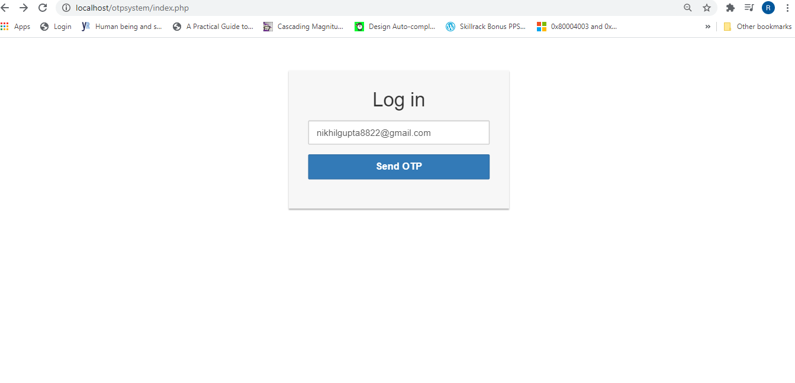
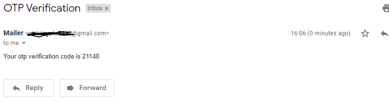
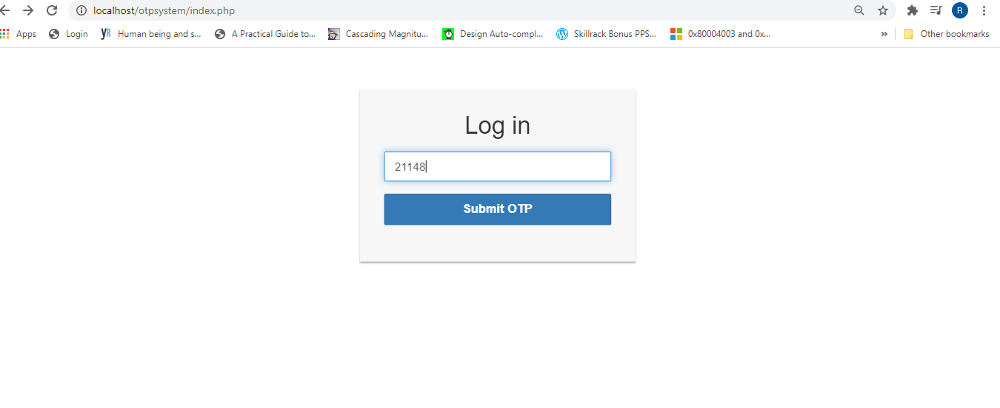
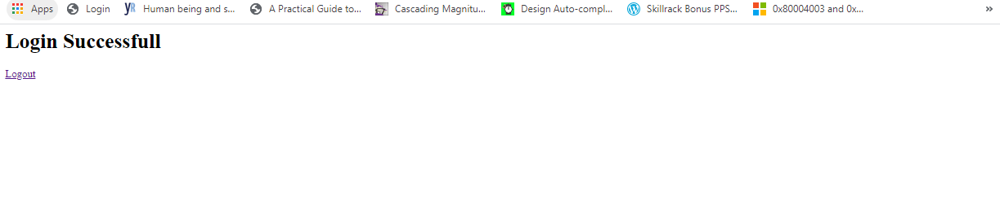

# OTP-System

Steps to run the project:- 
1. Clone the project t0 the respective Xamp or Wamp folder 
2. Make these changes int the send_output.php  
  $mail->Username = 'rachit@gmail.com'; // your email                  
	$mail->Password = 'your_password'; // your email password  
3. Run the index.php file 
<h2>OUTPUT Screenshots</h2>  
  
  
  
  
